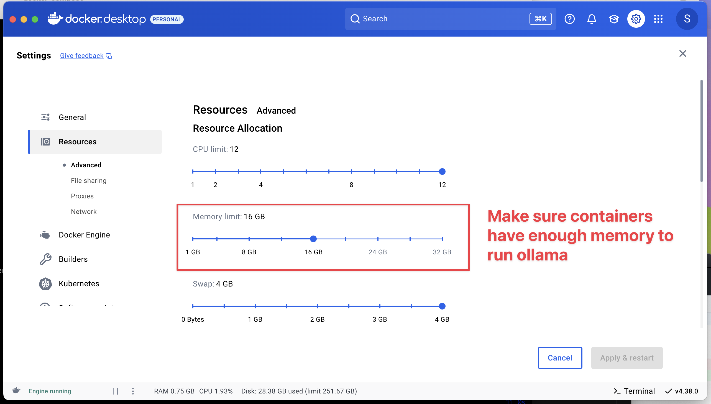

# 🍋 LLemonStack - Local AI Agent Stack

A fully featured, open source, low-code AI agent automation platform. Securely running in docker
containers.

Pre-configured and ready to squeeze. LLemoStack gets you up and running in minutes with
[n8n](https://n8n.io/), [Flowise](https://flowiseai.com/), [Supabase](https://supabase.com/),
[Qdrant](https://qdrant.tech/), [Zep](https://www.getzep.com/),
[LiteLLM](https://github.com/BerriAI/litellm), [Langfuse](https://github.com/langfuse/langfuse),
[Ollama](https://ollama.com/), and [Browser-Use](https://browser-use.com/) and more.


## Version

LLemonStack is currently a pre-release version. It works on macOS, Linux and Windows with WSL 2.

The scripts and API are in rapid development. Check the git history and pull regularly for bug
fixes.

## Walkthrough Video

[](https://www.youtube.com/watch?v=xRRRSbYE9TY "LLemonStack Walkthrough Video")

<br />

## Changelog

- Mar 23, 2035: v0.2.0: introduce `llmn` command

  - Moved all services to services/ dir for better isolation
  - All services now run independently with separate docker-compose.yml
  - Several bug fixes, start refactoring code for service based API

- Mar 15, 2025: BREAKING CHANGE: moved container volumes to ./volumes
- Mar 14, 2025: BREAKING CHANGE: switched to using supavisor instead of direct postgres db
  connection
  - See .env.example for changes to env variables
  - docker-compose.yml files were changed and now require a few new env vars to work
  - Replaced Supabase Analytics server (Logflare) with dummy server
- Mar 13, 2025: Fixed the init script
- Mar 12, 2025: Added custom n8n image with OTEL tracing, and ffmpeg support and Langfuse in n8n
  LangChain Code nodes
- Mar 10, 2025: Added LiteLLM and Langfuse to the stack

## Known Issues

Zep requires a quick workaround fix for a hard coded `public.role_type_num` bug. This is only an
issue when using the custom service_zep schema created by the init script..

See [examples/zep/README.md](examples/zep/README.md) for details and the quick fix.

<br />

## Overview

**LLemonStack** installs and runs a fully featured low code AI agent development playground,
including local LLMs and chat interfaces, from a single command: `llmn start`

Supports running on Linux, Mac, or Windows. Built on a Macbook M2, tested on Linux and Windows with
WSL 2.

### Main objectives of 🍋 LLemonStack are

> - 🚫 💰 **No cost**, low code AI agent playground
> - ✅ ⌛ **Up and running in minutes**
> - 🔧 🎁 Pre-configured stack of the latest open source AI tools
> - ⚡ 🤑 Rapid local dev & learning for fun & profit
> - 🚀 ☁️ Easy deploy to a production cloud
>
> 🍋🍋🍋🍋🍋 _5 lemon rating FTW_

Ultimately, LLemonStack aims to provide a comprehensive AI configuration framework & education
ecosystem... where sh!t just works so you can focus on the fun part of building AI agents.

With this first release, we're just scratching the surface of what's possible.

<br />

## What's included in the stack

The core stack (this repo) includes the most powerful & easy to to use open source AI agent
services. The services are pre-configured and ready to use. Networking, storage, and other docker
related headaches are handled for you. Just run the stack and start building AI agents.

<!-- markdownlint-disable MD013 MD033 -->

| Tool                                                 | Description                                                                                                     |
| ---------------------------------------------------- | --------------------------------------------------------------------------------------------------------------- |
| [**n8n**](https://n8n.io/)                           | Low-code automation platform with over 400 integrations and advanced AI components.                             |
| [**Flowise**](https://flowiseai.com/)                | No/low code AI agent builder, pairs very well with n8n.                                                         |
| [**Langfuse**](https://github.com/langfuse/langfuse) | LLM observability platform. Configured to auto log LiteLLM queries.                                             |
| [**LiteLLM**](https://github.com/BerriAI/litellm)    | LLM request proxy. Allows for cost control and observability of LLM token usage in the stack.                   |
| [**Supabase**](https://supabase.com/)                | Open source Firebase alternative, Postgres database, and pgvector vector store.                                 |
| [**Ollama**](https://ollama.com/)                    | Cross-platform LLM platform to install and run the latest local LLMs.                                           |
| [**Open WebUI**](https://openwebui.com/)             | ChatGPT-like interface to privately interact with your local models and N8N agents.                             |
| [**Qdrant**](https://qdrant.tech/)                   | Open-source, high performance vector store. Included to experiment with different vector stores.                |
| [**Zep**](https://www.getzep.com/)                   | Open-source chat history and graph vector store. Summarizes chat history to improve LLM response & RAG quality. |
| [**Browser-Use**](https://browser-use.com/)          | Open-source browser automation tool for automating complex browser interactions from simple prompts.            |

<br />
<br />

## Prerequisites

Before running the start/stop scripts, make sure you have the following (free) software installed on
your host machine.

- [**Docker/Docker Desktop**](https://www.docker.com/) - required to run all services, no need for a
  paid plan, just download the free Docker Desktop
- [**Deno**](https://docs.deno.com/runtime/getting_started/installation/) - required to run the
  start/stop scripts
- [**Git**](https://github.com/git-guides/install-git) - needed to clone stack services that require
  custom build steps

After you've installed the prerequisites, you won't need to directly use them. LLemonStack does all
the heavy lifting for you.

### How To Install the Prerequisites

1. Visit [**Docker/Docker Desktop**](https://www.docker.com/) and download the free Docker Desktop
   app

2. Use the below commands in a terminal to install deno and git

#### macOS

```bash
# Check if deno is already installed
deno -v

# If not, install using npm or Homebrew
brew -v # Check if brew is installed
brew install deno # Install deno

# If brew isn't installed, check if node is installed
npm -v
npm install -g deno # Install using npm

# If neither brew or node is installed, install brew
# Official website here: https://brew.sh/
# Command to install brew:
curl -fsSL https://raw.githubusercontent.com/Homebrew/install/HEAD/install.sh

# Then install deno
brew install deno

# Check if git is installed
git -v
brew install git # Install git if needed
```

#### Linux

```bash
# Install deno
curl -fsSL https://deno.land/install.sh | sh

# Check if git is installed
git -v
# Install git if needed
sudo apt-get update && sudo apt-get install git-all
```

#### Windows

LLemonStack works on Windows with WSL 2. For non-WSL, it hasn't been fully tested.

The best option on Windows is to use Windows Terminal with WSL and run the Linux commands above on a
Ubuntu or similar terminal.

If you're not comfortable using the command line to install apps...

- Download Deno [here](https://docs.deno.com/runtime/getting_started/installation)
- Download git [here](https://github.com/git-guides/install-git)

<br />

## Install LLemonStack

In a terminal, run the following commands

1. Clone this repo to your local machine

```bash
git clone https://github.com/llemonstack/llemonstack.git
```

2. Install dependencies & enable `llmn` command

```bash
cd llemonstack
deno install # Install dependencies
npm link # Enable the global llmn command
```

`npm link` creates a global symbolic link for `llmn` to `bin/cli.js`. Once the link is enabled, the
`llmn` command can be run from any directory.

3. Create a new LLemonStack project

```bash
# Create a new project directory anywhere on your system
cd ..
mkdir my_llemonstack_project && cd my_llemonstack_project

# Run the init script to configure a new stack
llmn init
```

LLemonStack supports multiple projects on the same machine. This allows you to experiment with
different settings or keep client projects separate from personal projects.

To create multiple projects, make sure the current stack is stopped by running `llmn stop` in the
project directory. Then create a new project directory and run `llmn init` inside of the new
directory.

Each project directory contains the unique `.env` file as well as the `volumes` directory that
stores that stack data. Contents of the `volumes` directory contains database data and other
persistent data needed to run the stack.

## Usage

```bash
# Shows the cli help with all the available commands
llmn --help

# Init a new project
llmn init

# Start the services
# Automatically installs dependencies & docker images as needed
llmn start
# Start a single service
llmn start [service]

# Stop all services
llmn stop
# Stop a specific service
llmn stop [service]
# ex: llmn stop n8n

# Show versions of all the stack services
llmn versions

# Update the stack services to the latest versions
llmn update

# Restart services - runs stop & start
llmn restart
llmn restart [service]

# Import
# Import data from ./import dir into all services that support importing
# Currently n8n & flowise
llmn import
# Import n8n only
llmn import n8n

# Export
# Export data to shared/ dir for all services that support exporting
# Currently only n8n is supported
llmn export n8n

# Reset the stack to the original default state
# Deletes all data & images and resets docker cache
llmn reset

# Create/remove a postgres schema
# Used by the init script, but can be useful for creating new schemas
# to keep n8n or flowise workflow data isolated from other tables.
llmn schema

# Generates bash|zsh completions for llmn
llmn completions
```

To enable auto completions for llmn, add the appropriate line below to your shell .rc file. Then
source your .rc file to enable completions in the current shell: `source ~/.bashrc` or
`source ~/.zshrc`

```bash
# Bash: ~/.bashrc
source <(llmn completions bash)

# Zsh: ~/.zshrc
source <(llmn completions zsh)
```

<br />

## ⚡️ n8n WorkflowQuick Start

TODO: rewrite this section

The main component of the self-hosted AI starter kit is a docker compose file pre-configured with
network and disk so there isn't much else you need to install. After completing the installation
steps above, follow the steps below to get started.

1. Open <http://localhost:5678/> in your browser to set up n8n. You'll only have to do this once.
   You are NOT creating an account with n8n in the setup here, it is only a local account for your
   instance!
2. Open the included workflow: <http://localhost:5678/workflow/vTN9y2dLXqTiDfPT>
3. Create credentials for every service:

   Ollama URL: http://ollama:11434

   Postgres (through Supabase): use DB, username, and password from .env. IMPORTANT: Host is 'db'
   since that is the name of the service running Supabase

   Qdrant URL: http://qdrant:6333

   Google Drive: Follow
   [this guide from n8n](https://docs.n8n.io/integrations/builtin/credentials/google/). Don't use
   localhost for the redirect URI, just use another domain you have, it will still work!

   Alternatively, you can set up
   [local file triggers](https://docs.n8n.io/integrations/builtin/core-nodes/n8n-nodes-base.localfiletrigger/).

4. Select **Test workflow** to start running the workflow.
5. If this is the first time you're running the workflow, you may need to wait until Ollama finishes
   downloading Llama3.1. You can inspect the docker console logs to check on the progress.
6. Make sure to toggle the workflow as active and copy the "Production" webhook URL!
7. Open <http://localhost:3000/> in your browser to set up Open WebUI. You'll only have to do this
   once. You are NOT creating an account with Open WebUI in the setup here, it is only a local
   account for your instance!
8. Go to Settings -> Admin Panel -> Functions -> Add Function -> Give name + description then paste
   in the code from `openwebui/n8n_pipe.py`
9. Click on the gear icon and set the n8n_url to the production URL for the webhook you copied in a
   previous step.
10. Toggle the function on and now it will be available in your model dropdown in the top left!

See https://openwebui.com/functions?query=n8n for more n8n functions.

To open n8n at any time, visit <http://localhost:5678/> in your browser. To open Open WebUI at any
time, visit <http://localhost:3000/>.

With your n8n instance, you'll have access to over 400 integrations and a suite of basic and
advanced AI nodes such as
[AI Agent](https://docs.n8n.io/integrations/builtin/cluster-nodes/root-nodes/n8n-nodes-langchain.agent/),
[Text classifier](https://docs.n8n.io/integrations/builtin/cluster-nodes/root-nodes/n8n-nodes-langchain.text-classifier/),
and
[Information Extractor](https://docs.n8n.io/integrations/builtin/cluster-nodes/root-nodes/n8n-nodes-langchain.information-extractor/)
nodes. To keep everything local, just remember to use the Ollama node for your language model and
Qdrant as your vector store.

> [!NOTE]
> This starter kit is designed to help you get started with self-hosted AI workflows. While it's not
> fully optimized for production environments, it combines robust components that work well together
> for proof-of-concept projects. You can customize it to meet your specific needs

<br />

## Ollama

There are several options for running Ollama locally.

1. Run ollama on your local machine (not in Docker)
   - Useful on a mac since ollama Docker image doesn't support Apple Silicon GPUs
2. Run ollama in a Docker container
   - There are different options for CPU, Nvidia GPUs, and AMD GPUs

See `ENABLE_OLLAMA` in `.env` for more details.

> [!NOTE]
> If you have not used your Nvidia GPU with Docker before, please follow the
> [Ollama Docker instructions](https://github.com/ollama/ollama/blob/main/docs/docker.md).

```bash
# .env
ENABLE_OLLAMA=gpu-nvidia
```

### For AMD GPU users on Linux

```bash
# .env
ENABLE_OLLAMA=gpu-amd
```

### For Mac / Apple Silicon users

If you're using a Mac with an M1 or newer processor, you can't expose your GPU to the Docker
instance, unfortunately. There are two options in this case:

1. Run the starter kit fully on CPU:

   ```bash
   # .env
   ENABLE_OLLAMA=cpu
   ```

2. Run Ollama on your Mac for faster inference, and connect to that from the n8n instance:

   ```bash
   # .env
   ENABLE_OLLAMA=host
   ```

   Ollama needs to be installed on your mac. See the [Ollama homepage](https://ollama.com/) or run
   `brew install ollama`.

   Then start the ollama service and pull models:

   ```bash
   ollama serve &
   ollama pull deepseek-r1:1.5b
   ```

   See [services/ollama/docker-compose.yaml](docker-compose.yaml) for the specific models used by
   the Docker container.

   Once ollama is running locally and `ENABLE_OLLAMA=host` is set in .env, start the services with
   `llmn start`

   Open WebUI should show the installed models in the dropdown if everything is working correctly.

Additionally, after you run the start script:

1. Head to http://localhost:5678/home/credentials
2. Click on "Local Ollama service"
3. Change the base URL to "http://host.docker.internal:11434/"

<br />

## Upgrading

To update all containers to their latest versions (n8n, Open WebUI, etc.), run the pull script:

```bash
# Update docker images to use the latest versions
llmn update

# Start the services
llmn start
```

<br />

## Importing & Exporting n8n Templates

LLemonStack provides script for easy importing and exporting of n8n credentials and workflow
templates.

Any template placed in the [import/n8n](import/n8n) directory will be imported.

The import script supports environment variables inside of the n8n credentials and workflows
templates. The variables are replaced with the values from `.env` at the time of import. This makes
it easy to auto configure templates with the correct settings for your stack.

See [examples/n8n/credentials](examples/n8n/credentials).

To import a template, simply copy it into the [import/n8n](import/n8n) directory. Then run the
import script.

Successfully imported files are then moved to the `import/.imported` directory for safe keeping. The
archived files include the expanded (replaced) environment variables. It's best practice to treat
the `import/` directory as `/tmp`. Keep backups of anything you added to the import directory to
preserve the original templates.

### Importing

```bash
# Import will throw an error if n8n is not already running
# Start services (if needed)
llmn start

# Copy files into the import/n8n directory
# For example...
cp examples/n8n/credentials/*.json import/n8n/credentials

# Run the import script
llmn import n8n

# Credential in import/n8n/credentials will be imported
# Workflows in import/n8n/workflows will be imported

# After successful import, files are moved to import/.imported
# for archiving
```

**IMPORTANT:** Importing overwrites existing credentials or workflows with the same IDs. Export the
workflows and credentials before importing.

### Exporting & Backing Up n8n Templates

```bash
llmn export n8n
# Exports n8n credentials and workflows to share/backups/n8n
```

See [n8n documentation](https://docs.n8n.io/hosting/cli-commands/#export-workflows-and-credentials)
for more details on importing and exporting.

<br />

## Troubleshooting

Here are solutions to common issues you might encounter:

### Supabase Issues

- **Supabase Pooler Restarting**: If the supabase-pooler container keeps restarting itself, follow
  the instructions in
  [this GitHub issue](https://github.com/supabase/supabase/issues/30210#issuecomment-2456955578).

- **Supabase Analytics Startup Failure**: If the supabase-analytics container fails to start after
  changing your Postgres password, delete the folder `supabase/docker/volumes/db/data`.

- **If using Docker Desktop**: Go into the Docker settings and make sure "Expose daemon on
  tcp://localhost:2375 without TLS" is turned on

To reset supabase, delete the volumes directory, the restart the services.

```bash
# Run the reset script to reset everything to a clean state
llmn reset
```

### Network Issues

```bash
# Login to a container as root
# Replace n8n with the name of the container
docker exec -it --user root n8n /bin/sh

# Verify you're logged in as root
whoami

# Install curl if needed
# Different containers use apt-get or apk
apt-get update && apt-get install -y curl
apk update && apk add curl

# Test the connection to the internet
curl -I https://www.google.com
```

### Ollama GPU Issues

- **Windows GPU Support**: If you're having trouble running Ollama with GPU support on Windows with
  Docker Desktop:

  1. Open Docker Desktop settings
  2. Enable WSL 2 backend
  3. See the [Docker GPU documentation](https://docs.docker.com/desktop/features/gpu/) for more
     details

- **Linux GPU Support**: If you're having trouble running Ollama with GPU support on Linux, follow
  the [Ollama Docker instructions](https://github.com/ollama/ollama/blob/main/docs/docker.md).

### Ollama Memory Issues

If the ollama container logs is showing memory errors, you likely need to increase the memory
allocated to Docker Desktop.

1. Open Docker Desktop settings
2. Go to Resources
3. Increase the memory to 12GB or more
4. Restart Docker Desktop



<br />

## 📔 Recommended reading

n8n is full of useful content for getting started quickly with its AI concepts and nodes.

- [AI agents for developers: from theory to practice with n8n](https://blog.n8n.io/ai-agents/)
- [Tutorial: Build an AI workflow in n8n](https://docs.n8n.io/advanced-ai/intro-tutorial/)
- [Langchain Concepts in n8n](https://docs.n8n.io/advanced-ai/langchain/langchain-n8n/)
- [Demonstration of key differences between agents and chains](https://docs.n8n.io/advanced-ai/examples/agent-chain-comparison/)
- [What are vector databases?](https://docs.n8n.io/advanced-ai/examples/understand-vector-databases/)

### 🛍️ More AI templates

For more AI workflow ideas, visit the
[**official n8n AI template gallery**](https://n8n.io/workflows/?categories=AI). From each workflow,
select the **Use workflow** button to automatically import the workflow into your local n8n
instance.

### Learn AI key concepts

- [AI Agent Chat](https://n8n.io/workflows/1954-ai-agent-chat/)
- [AI chat with any data source (using the n8n workflow too)](https://n8n.io/workflows/2026-ai-chat-with-any-data-source-using-the-n8n-workflow-tool/)
- [Chat with OpenAI Assistant (by adding a memory)](https://n8n.io/workflows/2098-chat-with-openai-assistant-by-adding-a-memory/)
- [Use an open-source LLM (via HuggingFace)](https://n8n.io/workflows/1980-use-an-open-source-llm-via-huggingface/)
- [Chat with PDF docs using AI (quoting sources)](https://n8n.io/workflows/2165-chat-with-pdf-docs-using-ai-quoting-sources/)
- [AI agent that can scrape webpages](https://n8n.io/workflows/2006-ai-agent-that-can-scrape-webpages/)

### Local AI templates

- [Tax Code Assistant](https://n8n.io/workflows/2341-build-a-tax-code-assistant-with-qdrant-mistralai-and-openai/)
- [Breakdown Documents into Study Notes with MistralAI and Qdrant](https://n8n.io/workflows/2339-breakdown-documents-into-study-notes-using-templating-mistralai-and-qdrant/)
- [Financial Documents Assistant using Qdrant and MistralAI](https://n8n.io/workflows/2335-build-a-financial-documents-assistant-using-qdrant-and-mistralai/)
- [Recipe Recommendations with Qdrant and Mistral](https://n8n.io/workflows/2333-recipe-recommendations-with-qdrant-and-mistral/)

<br />

## Tips & tricks

### Accessing local files

The self-hosted AI starter kit will create a shared folder (by default, located in the same
directory) which is mounted to the n8n container and allows n8n to access files on disk. This folder
within the n8n container is located at `/data/shared` -- this is the path you'll need to use in
nodes that interact with the local filesystem.

### Nodes that interact with the local filesystem

- [Read/Write Files from Disk](https://docs.n8n.io/integrations/builtin/core-nodes/n8n-nodes-base.filesreadwrite/)
- [Local File Trigger](https://docs.n8n.io/integrations/builtin/core-nodes/n8n-nodes-base.localfiletrigger/)
- [Execute Command](https://docs.n8n.io/integrations/builtin/core-nodes/n8n-nodes-base.executecommand/)
