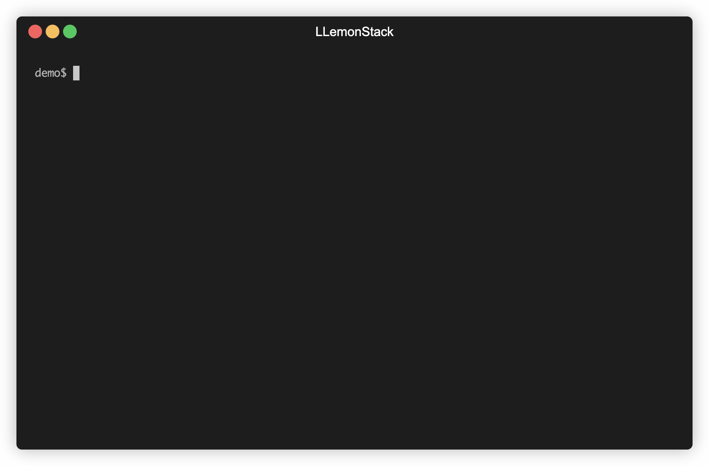

# 🍋 LLemonStack: Local AI Agent Stack

Open source, low-code AI agent automation platform, auto-configured and securely running in
docker containers.

Get up and running in minutes with
[n8n](https://n8n.io/), [Flowise](https://flowiseai.com/), [LightRAG](https://github.com/HKUDS/LightRAG), [Supabase](https://supabase.com/),
[Qdrant](https://qdrant.tech/),
[LiteLLM](https://github.com/BerriAI/litellm), [Langfuse](https://github.com/langfuse/langfuse),
[Ollama](https://ollama.com/), [Firecrawl](https://github.com/mendableai/firecrawl), [Craw4AI](https://github.com/unclecode/crawl4ai),
[Browser-Use](https://browser-use.com/) and more.

> 💰 **No cost**, no/low code AI agent playground
>
> ✅ **Up and running in minutes**
>
> 🔧 Pre-configured stack of the latest open source AI tools
>
> ⚡ Rapid local dev & learning for fun & profit
>
> 🚀 Easy deploy to a production cloud

LLemonStack makes it easy to get 17+ leading AI tools installed, configured, and running on your local machine in minutes with a single command line tool.

It was created to make development and testing of complex AI agents as easy as possible without any cost.

LLemonStack can even run local AI models for you via Ollama.

It provides advanced debugging and tracing capabilities to help you understand exactly how
your agents work, and most importantly... how to fix them when they break.

<br />

## Quick Start

Deno and Docker must already be installed.
See [Install](#install-llemonstack) section below.

```bash
git clone https://github.com/llemonstack/llemonstack.git
cd llemonstack
deno install # Install dependencies
npm link # Enable the llmn command

# Initialize a new project
llmn init
# Optionally configure the stack services
llmn config
# Start the stack
llmn start
```

## Walkthrough Video

[](https://www.youtube.com/watch?v=xRRRSbYE9TY "LLemonStack Walkthrough Video")

<br />

## Screenshots

`llmn init` - initialize a new project



`llmn config` - configure stack services


`llmn start` - start the stack


On start, dashboard & API urls are shown along with the auto generated credentials.

<br />

## Key Features

- Create, start, stop & update an entire stack with a single command: `llmn`
- Auto configs services, generates **secure credentials**
- Displays enabled services dashboard & API urls
- Creates isolated stacks per project
- Shares database services to reduce memory and CPU usage
- Uses postgres schemas to keep service tables isolated
- Builds services from git repos as needed
- Includes custom n8n with ffmpeg and telemetry enabled
- Provides import/export tools with support for auto configuring credentials per stack
- Includes LiteLLM and Langfuse for easy LLM config & observability

<br />

## Changelog

- Apr 25, 2025: Added Firecrawl service
- Apr 24, 2025: Added custom migration to supabase to enable pgvector extension by default
- Apr 20, 2025: Added LightRAG
- Apr 17, 2025: fix Flowise start and API key issues
- Apr 1, 2025: v0.3.0 pre-release

  - Remove ENABLE\_\* vars from .env and use `llmn config` to enable/disable services
  - Major refactor of internal APIs to make it easier to add and manage services
  - Internal code is still be migrated to the new API, there may be bugs

- Mar 23, 2035: v0.2.0: introduce `llmn` command

## Known Issues

### Flowise

Flowise generates an API key when it's first started. The key is saved to `volumes/flowise/config/api.json`
in the project's volumes folder. Re-run `llmn start` to see the API key in the start script
output or get the key from the api.json file when needed.

<br />

## OS Support

LLemonStack run all services in Docker. It was built on a Macbook M2, tested on Linux and Windows with WSL 2.

Mac and Linux, and Windows with WSL 2 enabled should work without any modifications.

Running LLemonStack directly on Windows (without WSL 2) needs further testing, but should
work without major modifications.

<br />

## What's included in the stack

The core stack (this repo) includes the most powerful & easy to to use open source AI agent
services. The services are pre-configured and ready to use. Networking, storage, and other docker
related headaches are handled for you. Just run the stack and start building AI agents.

<!-- markdownlint-disable MD013 MD033 -->

| Tool                                                     | Description                                                                                             |
| -------------------------------------------------------- | ------------------------------------------------------------------------------------------------------- |
| [**n8n**](https://n8n.io/)                               | Low-code automation platform with over 400 integrations and advanced AI components.                     |
| [**Flowise**](https://flowiseai.com/)                    | No/low code AI agent builder, pairs very well with n8n.                                                 |
| [**Langfuse**](https://github.com/langfuse/langfuse)     | LLM observability platform. Configured to auto log LiteLLM queries.                                     |
| [**LiteLLM**](https://github.com/BerriAI/litellm)        | LLM request proxy. Allows for cost control and observability of LLM token usage in the stack.           |
| [**Supabase**](https://supabase.com/)                    | Open source Firebase alternative, Postgres database, and pgvector vector store.                         |
| [**Ollama**](https://ollama.com/)                        | Cross-platform LLM platform to install and run the latest local LLMs.                                   |
| [**Open WebUI**](https://openwebui.com/)                 | ChatGPT-like interface to privately interact with your local models and N8N agents.                     |
| [**LightRAG**](https://github.com/HKUDS/LightRAG)        | Best-in-class RAG system that outperforms naive RAG by 2x in some benchmarks.                           |
| [**Qdrant**](https://qdrant.tech/)                       | Open-source, high performance vector store. Included to experiment with different vector stores.        |
| [**Zep**](https://www.getzep.com/)                       | Chat history and graph vector store. (Deprecated) Zep CE is no longer maintained, use LightRAG instead. |
| [**Browser-Use**](https://browser-use.com/)              | Open-source browser automation tool for automating complex browser interactions from simple prompts.    |
| [**Dozzle**](https://github.com/amir20/dozzle)           | Real-time log viewer for Docker containers, used to view logs of the stack services.                    |
| [**Firecrawl**](https://github.com/mendableai/firecrawl) | API for scraping & crawling websites and extracting data into LLM-friendly content.                     |
| [**Craw4AI**](https://github.com/unclecode/crawl4ai)     | Dashboard & API for scraping & crawling websites and extracting data into LLM-friendly content.         |

The stack includes several dependency services used to store data for the core services. Neo4J, Redis, Clickhouse, Minio, etc.

<br />

## How it works

LLemonStack is comprised of the following core features:

1. `llmn` CLI command - init, start, stop, config, etc.
2. [services](services/) folder with `llemonstack.yaml` and `docker-compose.yaml` for each service
3. `.llemonstack/config.json` and `.env` file for each project

When a new project is initialized with `llmn init`, the script creates `.llemonstack/config.json` and
`.env` files in the project's folder. The init script auto generates secure credentials for each service, creates unique schemas for services that use postgres, and populates the `.env` file.

The config.json file keeps track of which services are enabled for the project. Services can be enabled or disabled by running `llmn config` or manually editing the config.json file.

Each service's `llemonstack.yaml` file is used to configure the service. The file tracks dependencies,
dashboard URLs, etc.

When a stack is started with `llmn start`, the config.json file is loaded and each enabled service's
`docker-compose.yaml` file is used to start the service. Services are grouped into `databases`,
`middleware` and `apps` tiers, ensuring dependencies are started before the services that depend on them.

LLemonStack automatically takes care of docker networking, ensuring services can talk to each other
within the stack (internal) and service dashboards can be accessed from the host.

When a stack is stopped with `llmn stop` all services and related docker networks are removed.
This allows for multiple LLemonStack projects to be created on the same machine without conflicting
with each other.

See [Adding Services](#adding-services) section below for instructions on adding custom services to a stack.

<br />

## Prerequisites

Before running the start/stop scripts, make sure you have the following (free) software installed on
your host machine.

- [**Docker/Docker Desktop**](https://www.docker.com/) - required to run all services, no need for a
  paid plan, just download the free Docker Desktop
- [**Deno**](https://docs.deno.com/runtime/getting_started/installation/) - required to run the
  start/stop scripts
- [**Git**](https://github.com/git-guides/install-git) - needed to clone stack services that require
  custom build steps

After installing the prerequisites, you won't need to directly use them. LLemonStack does all
the heavy lifting for you.

### How To Install the Prerequisites

1. Visit [**Docker/Docker Desktop**](https://www.docker.com/) and download the free Docker Desktop
   app

2. Use the below commands in a terminal to install deno and git

#### macOS

```bash
# Check if deno is already installed
deno -v

# If not, install using npm or Homebrew
brew -v # Check if brew is installed
brew install deno # Install deno

# If brew isn't installed, check if node is installed
npm -v
npm install -g deno # Install using npm

# If neither brew or node is installed, install brew
# Official website here: https://brew.sh/
# Command to install brew:
curl -fsSL https://raw.githubusercontent.com/Homebrew/install/HEAD/install.sh

# Then install deno
brew install deno

# Check if git is installed
git -v
brew install git # Install git if needed
```

#### Linux

```bash
# Install deno
curl -fsSL https://deno.land/install.sh | sh

# Check if git is installed
git -v
# Install git if needed
sudo apt-get update && sudo apt-get install git-all
```

#### Windows

LLemonStack works on Windows with WSL 2. For non-WSL, it hasn't been fully tested.

The best option on Windows is to use Windows Terminal with WSL and run the Linux commands above on a
Ubuntu or similar terminal.

If you're not comfortable using the command line to install apps...

- Download Deno [here](https://docs.deno.com/runtime/getting_started/installation)
- Download git [here](https://github.com/git-guides/install-git)

<br />

## Install LLemonStack

In a terminal, run the following commands

1. Clone this repo to your local machine

```bash
git clone https://github.com/llemonstack/llemonstack.git
```

2. Install dependencies & enable `llmn` command

```bash
cd llemonstack
deno install # Install dependencies

# Enable the global llmn command
npm link

# llmn is now available to use from any directory
```

`npm link` creates a global symbolic link for `llmn` to `bin/cli.js`. Once the link is enabled, the
`llmn` command can be run from any directory.

3. Create a new LLemonStack project

```bash
# Create a new project directory anywhere on your system
cd ..
mkdir mystack && cd mystack

# Run the init script to configure a new stack
llmn init
```

LLemonStack supports multiple projects on the same machine. This allows you to experiment with
different settings or keep client projects separate from personal projects.

To create multiple projects, make sure the current stack is stopped by running `llmn stop` in the
project directory. Then create a new project directory and run `llmn init` inside of the new
directory.

Each project directory contains the unique `.env`, `config.json` and `volumes` directory that
stores that stack data. Contents of the `volumes` directory contains database data and other
persistent data needed to run the stack. This keeps each stack project isolated from other
projects on the same machine.

## Usage

```bash
# Shows the cli help with all the available commands
llmn --help

# Init a new project
llmn init

# Enable/disable services
llmn config

# Start the services
# Automatically installs dependencies & docker images as needed
llmn start
# Start a single service
llmn start [service]

# Stop all services
llmn stop
# Stop a specific service
llmn stop [service]
# ex: llmn stop n8n

# Show versions of all the stack services
llmn versions

# View enabled services and other info
llmn info

# Update the stack services to the latest versions
llmn update

# Restart services - runs stop & start
llmn restart
llmn restart [service]

# Import
# Import data from ./import dir into all services that support importing
# Currently n8n & flowise
llmn import
# Import n8n only
llmn import n8n

# Export
# Export data to shared/ dir for all services that support exporting
# Currently only n8n is supported
llmn export n8n

# Reset the stack to the original default state
# Deletes all data & images and resets docker cache
llmn reset

# Create/remove a postgres schema
# Used by the init script, but can be useful for creating new schemas
# to keep n8n or flowise workflow data isolated from other tables.
llmn schema

# Generates bash|zsh completions for llmn
llmn completions
```

To enable auto completions for llmn, add the appropriate line below to your shell .rc file. Then
source your .rc file to enable completions in the current shell: `source ~/.bashrc` or
`source ~/.zshrc`

```bash
# Bash: ~/.bashrc
source <(llmn completions bash)

# Zsh: ~/.zshrc
source <(llmn completions zsh)
```

<br />

## Ollama

There are several options for running Ollama locally.

1. Run ollama on your local machine (not in Docker)
   - Useful on a mac since ollama Docker image doesn't support Apple Silicon GPUs
2. Run ollama in a Docker container
   - There are different options for CPU, Nvidia GPUs, and AMD GPUs

Run `llmn config` to enable/disable Ollama and change how Ollama is run.

> [!NOTE]
> If you have not used your Nvidia GPU with Docker before, please follow the
> [Ollama Docker instructions](https://github.com/ollama/ollama/blob/main/docs/docker.md).

### For Mac / Apple Silicon users

If you're using a Mac with an M1 (Apple Silicon) or newer processor, you can't expose your GPU to the Docker
instance, unfortunately.

Run `llmn config` to configure Ollama.

There are two options for Mac Silicon users:

1. Run Ollama in Docker using the `Run on CPU` config option
2. Run Ollama directly on your Mac and use the `Run on Host` config option

   Ollama needs to be installed on your mac. See the [Ollama homepage](https://ollama.com/) or run
   `brew install ollama`.

   Then start the ollama service and pull models:

   ```bash
   ollama serve &
   ollama pull deepseek-r1:1.5b
   ```

   See [services/ollama/docker-compose.yaml](docker-compose.yaml) for the specific models used by
   the Docker container.

   Open WebUI should show the installed models in the dropdown if everything is working correctly.

<br />

## Upgrading

To update all services to their latest versions, run the update script.
Update will pull the latest Docker images as well as pull and rebuild services use
a git repo.

```bash
# Update docker images to use the latest versions
llmn update

# Start the services
llmn start
```

LLemonStack does not currently auto update it's own code.
This is by design while the project is in rapid pre-release development.

To update LLemonStack's code to the latest version...

```bash
# Get the LLemonStack install dir
llmn info

# cd into the Install Dir folder

# Pull the latest code changes
git pull
```

<br />

## Using Custom n8n for Debugging or FFmpeg

LLemonStack includes a custom n8n option that enables advanced debugging features and ffmpeg support for n8n.

The custom n8n Docker container can also be used as a template for additional customization.
See [services/n8n/](services/n8n/).

To enable the n8n tracing features...

```bash
# Run the config script
llmn config
# Select Enable for n8n
# Then select the n8n with custom tracing option
```

Then edit the n8n section of your `.env` file...

1. Set `N8N_OTEL_SDK_DISABLED` to false to enable tracing
2. Add your Honeycomb API key or change the OTEL_ENDPOINT to a different OTEL provider

```bash
# Example .env file n8n Honeycomb config...

# OpenTelemetry settings
N8N_OTEL_SDK_DISABLED=false

# Base endpoint for OpenTelemetry
N8N_OTEL_EXPORTER_OTLP_ENDPOINT=https://api.honeycomb.io
# Honeycomb settings for OpenTelemetry in n8n container
HONEYCOMB_API_KEY=your-honeycomb-api-key
N8N_OTEL_EXPORTER_OTLP_HEADERS=x-honeycomb-team=${HONEYCOMB_API_KEY}
```

Restart the n8n service...

```bash
llmn restart n8n
```

n8n will now send workflow traces to the OTEL provider. The traces allow you to see exactly which
nodes were run in your n8n workflows. It's particularly useful for debugging workflow errors.

<br />

## Importing & Exporting n8n Templates

LLemonStack includes an import script for easy importing of credentials and workflows.

n8n and Flowise are currently supported by the import script.

Any template placed in the [import/n8n](import/n8n) directory will be imported.

The import script supports environment variables inside of the n8n credentials and workflows
templates. The variables are replaced with the values from `.env` at the time of import. This makes
it easy to auto configure templates with the correct settings for your stack.

See [examples/n8n/credentials](examples/n8n/credentials).

To import a n8n template, copy the template files into the [import/n8n](import/n8n) directory. Then run the
import script.

Successfully imported files are then moved to the `import/.imported` directory for safe keeping. The
archived files include the expanded (replaced) environment variables. It's best practice to treat
the `import/` directory as `/tmp`. Keep backups of anything you added to the import directory to
preserve the original templates.

### Importing

```bash
# Import will throw an error if n8n is not already running
# Start services (if needed)
llmn start

# Copy files into the import/n8n directory
# For example...
cp examples/n8n/credentials/*.json import/n8n/credentials

# Run the import script
llmn import n8n

# Credential in import/n8n/credentials will be imported
# Workflows in import/n8n/workflows will be imported

# After successful import, files are moved to import/.imported
# for archiving
```

**IMPORTANT:** Importing overwrites existing credentials or workflows with the same IDs. Export the
workflows and credentials before importing.

### Exporting & Backing Up n8n Templates

```bash
llmn export n8n
# Exports n8n credentials and workflows to share/backups/n8n
```

See [n8n documentation](https://docs.n8n.io/hosting/cli-commands/#export-workflows-and-credentials)
for more details on importing and exporting.

<br />

## Troubleshooting

Here are solutions to common issues you might encounter:

### Supabase Issues

- **Supabase Pooler Restarting**: If the supabase-pooler container keeps restarting itself, follow
  the instructions in
  [this GitHub issue](https://github.com/supabase/supabase/issues/30210#issuecomment-2456955578).

### Network Issues

```bash
# Login to a container as root
# Replace n8n with the name of the container
docker exec -it --user root n8n /bin/sh

# Verify you're logged in as root
whoami

# Install curl if needed
# Different containers use apt-get or apk
apt-get update && apt-get install -y curl
apk update && apk add curl

# Test the connection to the internet
curl -I https://www.google.com
```

### Ollama GPU Issues

- **Windows GPU Support**: If you're having trouble running Ollama with GPU support on Windows with
  Docker Desktop:

  1. Open Docker Desktop settings
  2. Enable WSL 2 backend
  3. See the [Docker GPU documentation](https://docs.docker.com/desktop/features/gpu/) for more
     details

- **Linux GPU Support**: If you're having trouble running Ollama with GPU support on Linux, follow
  the [Ollama Docker instructions](https://github.com/ollama/ollama/blob/main/docs/docker.md).

### Ollama Memory Issues

If the ollama container logs is showing memory errors, you likely need to increase the memory
allocated to Docker Desktop.

1. Open Docker Desktop settings
2. Go to Resources
3. Increase the memory to 12GB or more
4. Restart Docker Desktop


<br />

## 📔 Recommended reading

n8n is full of useful content for getting started quickly with its AI concepts and nodes.

- [AI agents for developers: from theory to practice with n8n](https://blog.n8n.io/ai-agents/)
- [Tutorial: Build an AI workflow in n8n](https://docs.n8n.io/advanced-ai/intro-tutorial/)
- [Langchain Concepts in n8n](https://docs.n8n.io/advanced-ai/langchain/langchain-n8n/)
- [Demonstration of key differences between agents and chains](https://docs.n8n.io/advanced-ai/examples/agent-chain-comparison/)
- [What are vector databases?](https://docs.n8n.io/advanced-ai/examples/understand-vector-databases/)

### 🛍️ More AI templates

For more AI workflow ideas, visit the
[**official n8n AI template gallery**](https://n8n.io/workflows/?categories=AI). From each workflow,
select the **Use workflow** button to automatically import the workflow into your local n8n
instance.

### Learn AI key concepts

- [AI Agent Chat](https://n8n.io/workflows/1954-ai-agent-chat/)
- [AI chat with any data source (using the n8n workflow too)](https://n8n.io/workflows/2026-ai-chat-with-any-data-source-using-the-n8n-workflow-tool/)
- [Chat with OpenAI Assistant (by adding a memory)](https://n8n.io/workflows/2098-chat-with-openai-assistant-by-adding-a-memory/)
- [Use an open-source LLM (via HuggingFace)](https://n8n.io/workflows/1980-use-an-open-source-llm-via-huggingface/)
- [Chat with PDF docs using AI (quoting sources)](https://n8n.io/workflows/2165-chat-with-pdf-docs-using-ai-quoting-sources/)
- [AI agent that can scrape webpages](https://n8n.io/workflows/2006-ai-agent-that-can-scrape-webpages/)

### Local AI templates

- [Tax Code Assistant](https://n8n.io/workflows/2341-build-a-tax-code-assistant-with-qdrant-mistralai-and-openai/)
- [Breakdown Documents into Study Notes with MistralAI and Qdrant](https://n8n.io/workflows/2339-breakdown-documents-into-study-notes-using-templating-mistralai-and-qdrant/)
- [Financial Documents Assistant using Qdrant and MistralAI](https://n8n.io/workflows/2335-build-a-financial-documents-assistant-using-qdrant-and-mistralai/)
- [Recipe Recommendations with Qdrant and Mistral](https://n8n.io/workflows/2333-recipe-recommendations-with-qdrant-and-mistral/)

<br />

## Tips & tricks

### Accessing local files

The self-hosted AI starter kit will create a shared folder (by default, located in the same
directory) which is mounted to the n8n container and allows n8n to access files on disk. This folder
within the n8n container is located at `/data/shared` -- this is the path you'll need to use in
nodes that interact with the local filesystem.

### Nodes that interact with the local filesystem

- [Read/Write Files from Disk](https://docs.n8n.io/integrations/builtin/core-nodes/n8n-nodes-base.filesreadwrite/)
- [Local File Trigger](https://docs.n8n.io/integrations/builtin/core-nodes/n8n-nodes-base.localfiletrigger/)
- [Execute Command](https://docs.n8n.io/integrations/builtin/core-nodes/n8n-nodes-base.executecommand/)

<br />

## Adding Services

LLemonStack comes pre-configured with many popular services in the [services](./services/) folder.

To add additional services or customize existing services...

1. Create a `services` folder in your project or anywhere on the host machine
2. Edit the project's `.llemonstack/config.json` file and add the new `services` folder to dirs -> services.
3. Create a `llemonstack.yaml` and `docker-compose.yaml` file for the new service

When a project is started with `llmn start`, the script scans any services dirs listed in the
`config.json` file as well as the main services dir where LLemonStack was initially installed.

Services in dirs listed in `config.json` will take priority over the core (default) services if any services
have the same name.

For each new service, create the following files:

- `llemonstack.yaml`
- `docker-compose.yaml`

Refer to examples in the [services](./services/) folder.

Please open a GitHub Issue if there is a service you'd like to see added as a core service.
