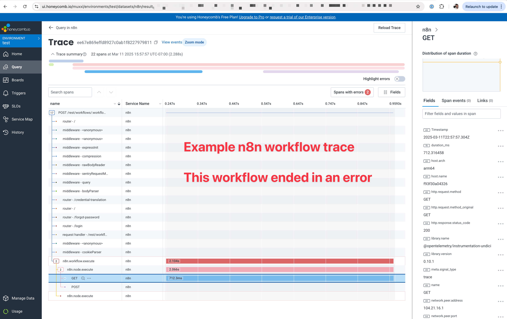

# Custom n8n Docker Image with Open Telemetry

Adds automatic tracing of n8n workflows to the otel provider configured in env variables.

```bash
# Set Honeycomb API key in local env
export HONEYCOMB_API_KEY=your-api-key

# Build and start the image
docker compose build

# Start the image
docker compose up

# Or rebuild and start the image
docker compose up --build
```

n8n workflows are then automatically logged to the OTEL backend (e.g. Honeycomb).

View traces in Honeycomb to see the full workflow session.

Here's an example screenshot showing an n8n workflow execution
being traced in Honeycomb. The example workflow threw an error.


